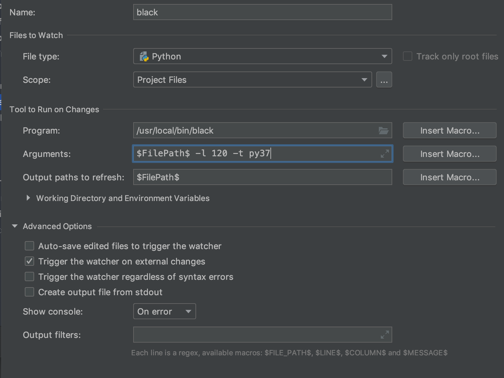

# python projects contribution guidelines

## formatting 

Formatting is done using https://black.readthedocs.io/en/stable/

```
cd /sandbox/code/github/threefoldtech/jumpscaleX/Jumpscale
black . -l 120 -t py37 --exclude 'templates'
```
**ALWAYS USE THE OPTIONS AS PROVIDED HERE** 

to intall

```bash
pip3 install black
```

make sure to follow instructions on https://black.readthedocs.io/en/stable/editor_integration.html to integrate in your editor.



do not forget to add the options '-l 120 -t py37' in your editor

## Linting
- Max-line length = 120
- as much as possible pep8 compliant as done by black


## naming conventions
- function names:
  - snake_cased
  - object_verb (example: file_get)

- variable names:
  - snake_case 

## Quotes
- Stick to single quotes where applicable

## docstrings
Sphinx-style docstrings
example:

```
"""[summary]

:param path: [description]
:type path: [type]
:raises j.exceptions.Input: [description]
:return: [description]
:rtype: [type]
"""
```


