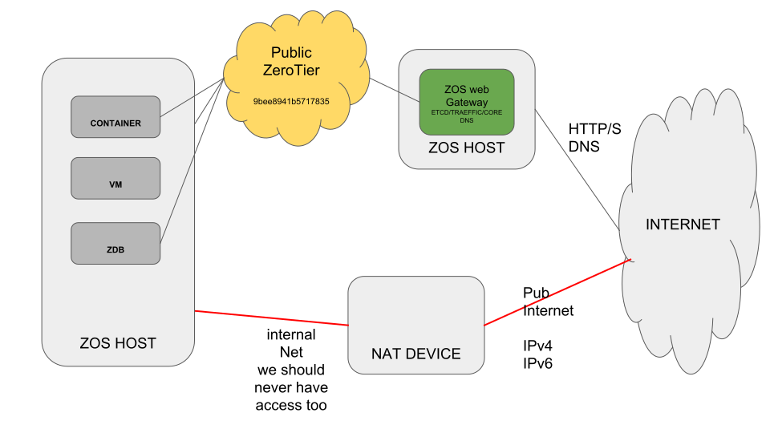

# Threefold grid network

## Threefold grid networks
The threefold grid network is currently composed of 3 zerotier networks. These networks have different usages and provide different features to the grid.

In the next diagram you can see an overview of the grid and how the different network are organized.

### Farmer network (c7c8172af1f387a6)
All the farmers that are providing capacity to the threefold grid configure their node to boot into this network. The result is that all the node robots of every node in the grid are accessible on this network.

So any user of the grid, would it be human or virtual (3Bot) need to join this network in order to be able to deploy workload on the grid.

### Public threefold network (9bee8941b5717835)
This is the global public network of threefold grid. By default, any workload deployed on the grid will be reachable in this network. This also means any workload in this network is able to communicate to any other workload deployed anywhere else on the grid, you can see it as the internet of the grid. As long as you don't have to expose your services to the outside of the grid, this network is all you need to use.

### Support network
This network is currently used by the developer of the grid as an easy way to support farmer and user if any thing goes wrong. Any zero-os booted with the kernel flag `support` will automatically join this network.

This network is intended to be deleted in the future once we slow down the rhythm of changes happening on the grid.

## How to expose your workload to the global internet
We have seen that by default any workload deploy in the threefold grid will by default join the public threefold network. But what if you need to expose your workload outside of the threefold grid ?

To expose your workload to the global internet, we provide a `gateway` that interface the threefold grid with internet. Through this gateway you can expose any HTTP services. We also provide a way to bind a domain name to the ip of a gateway so you can have nice URLs and HTTPS for you services.

