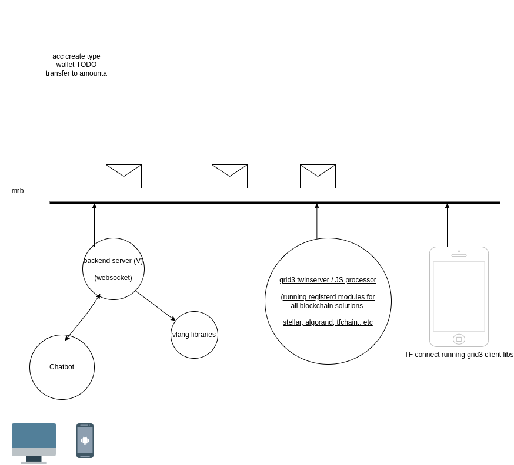

# Blockchain & UI work

We have a lot of work to be done for user interface and today it goes too slow because of complexities with UI work in general as such we suggest to now implement a generic usable chat interface which can integrate with any of our requirements at backend.

RMB would be the protocol but signing needs to happen at client side (javascript maybe in tfconnect).

## Flow

- A javascript processor(grid3_client_ts) should contain all the functionalities for the supported Blockchain types with a very simple interface.
- This javascript processor should be usable on Threefold Connect, browser, or as a nodejs server (twinserver).

### Connection

in order to connect the chatbot and threefold connect app, there are some suggested approaches:

1- assuming that threefold connect app can reach yggdrasil network, and it has a twinID, then the chatbot and the app can send messages to each other over RMB.

2- assuming that the chatbot has a public endpoint, then the threefold connect app can initiate a connection with the chatbot over websocket by scanning a QRcode maybe.

3- assuming that the threefold connect app can't reach yggdrasil network, then implement an endpoint on the chatbot over RMB to allow threefold connect app to pull the message from them.

## Components Specs

- [chatbot](chat_bot_widget.md)
- [javascript processor](javascript_processor.md)
- [questions](questions.md)

## main requirements

- backend code can be done in vlang, driving of the chats
- super reliable (rmb based)
- super easy to use, no complicated multiple wallet management, ... (tfconnect better integration)?
