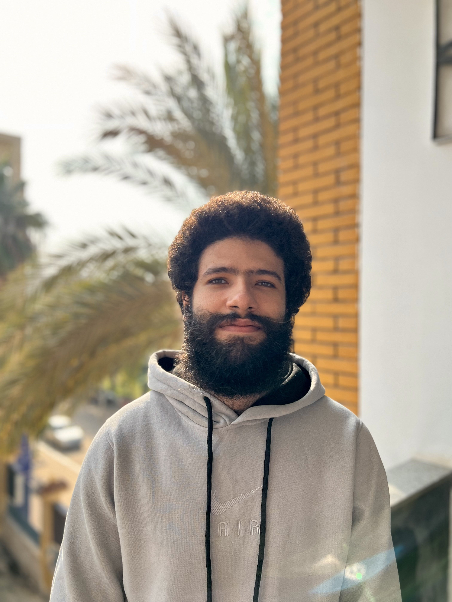

## Abdulrahman Elawady



- specialities/skills
  - Rust
  - Terraform
  - Golang
  - Docker

- active products
  - [zos](https://github.com/threefoldtech/zos)
  - [rmb-rs](https://github.com/threefoldtech/rmb-rs)
  - [tfgrid-sdk-go](https://github.com/threefoldtech/tfgrid-sdk-go)
  - [terraform-provider-grid](https://github.com/threefoldtech/terraform-provider-grid)
  
- location: Egypt
- reports_to: [Ashraf](https://github.com/threefoldtech/home/blob/master/wiki/team/ashraf_fouda.md)

- telegram: ael3wady
- github: AbdelrahmanElawady
- email: abdoelawdy125@gmail.com
- 3bot: aelawady.3bot
- gitea: aelawady

## SSHKey

```bash
ssh-rsa AAAAB3NzaC1yc2EAAAADAQABAAABgQDcGrS1RT36rHAGLK3/4FMazGXjIYgWVnZ4bCvxxg8KosEEbs/DeUKT2T2LYV91jUq3yibTWwK0nc6O+K5kdShV4qsQlPmIbdur6x2zWHPeaGXqejbbACEJcQMCj8szSbG8aKwH8Nbi8BNytgzJ20Ysaaj2QpjObCZ4Ncp+89pFahzDEIJx2HjXe6njbp6eCduoA+IE2H9vgwbIDVMQz6y/TzjdQjgbMOJRTlP+CzfbDBb6Ux+ed8F184bMPwkFrpHs9MSfQVbqfIz8wuq/wjewcnb3wK9dmIot6CxV2f2xuOZHgNQmVGratK8TyBnOd5x4oZKLIh3qM9Bi7r81xCkXyxAZbWYu3gGdvo3h85zeCPGK8OEPdYWMmIAIiANE42xPmY9HslPz8PAYq6v0WwdkBlDWrG3DD3GX6qTt9lbSHEgpUP2UOnqGL4O1+g5Rm9x16HWefZWMjJsP6OV70PnMjo9MPnH+yrBkXISw4CGEEXryTvupfaO5sL01mn+UOyE= abdulrahman@AElawady-PC
```
