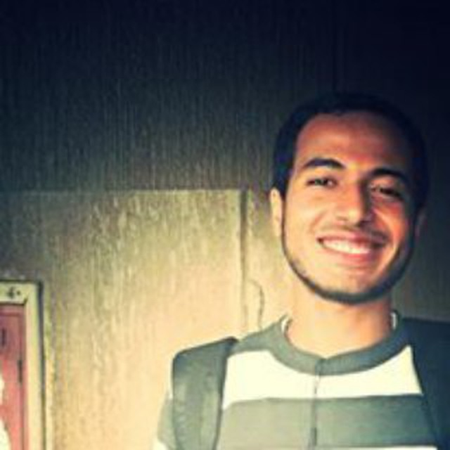
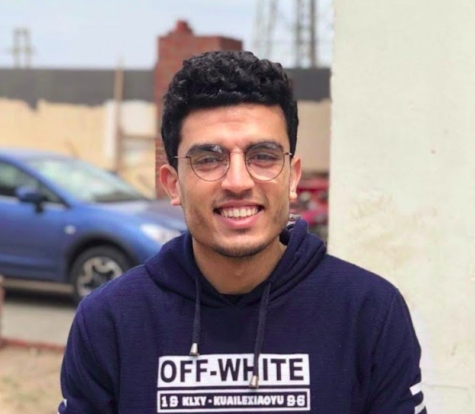
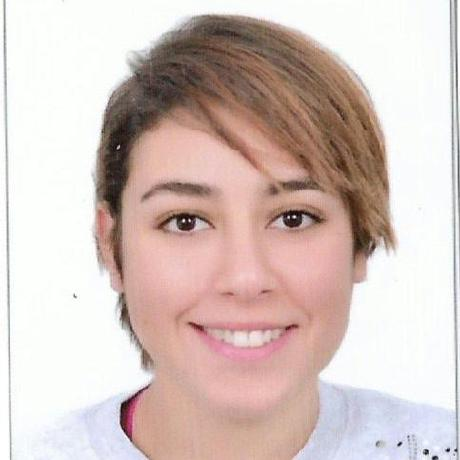
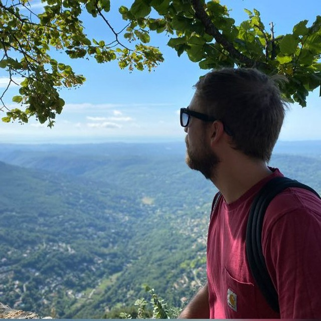
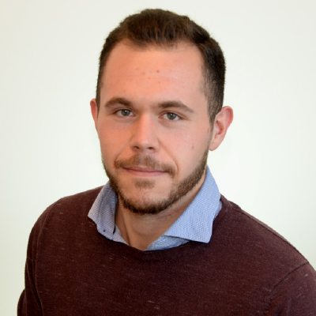
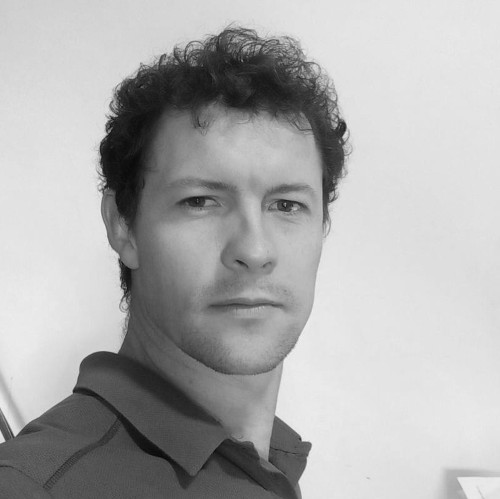
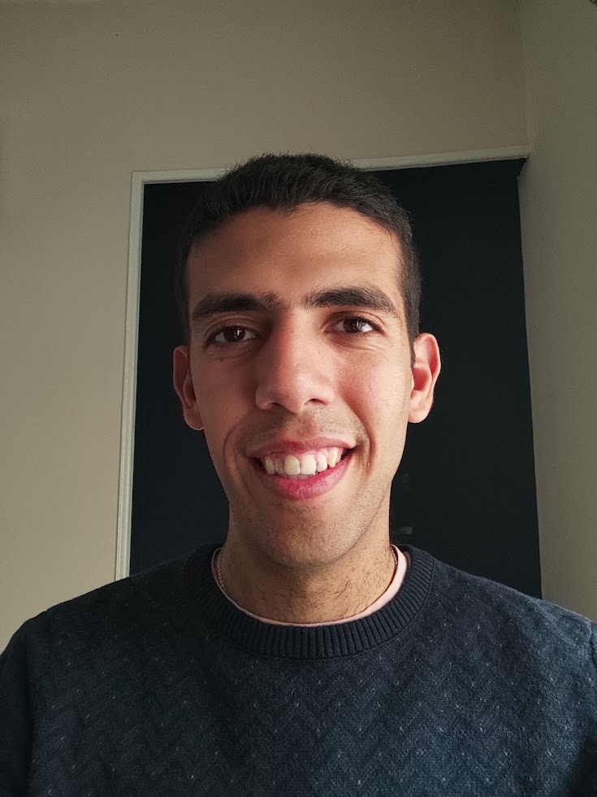
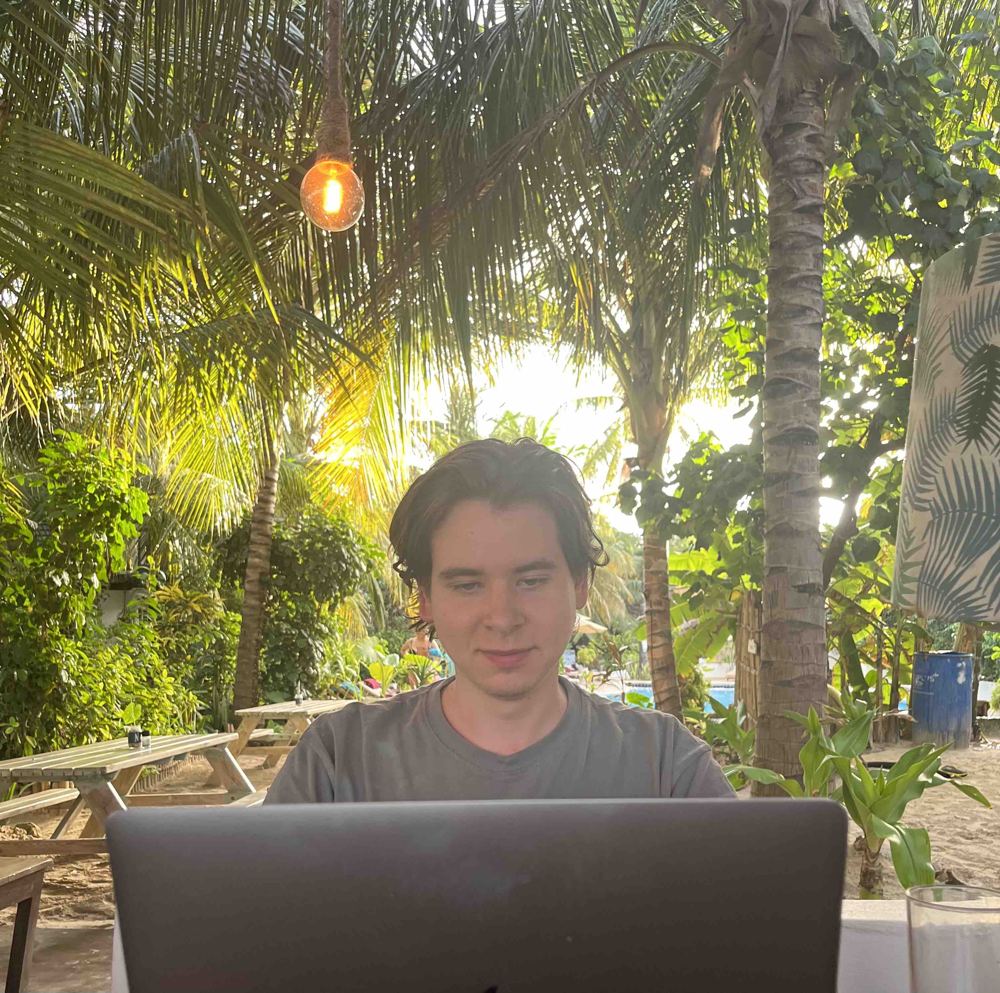
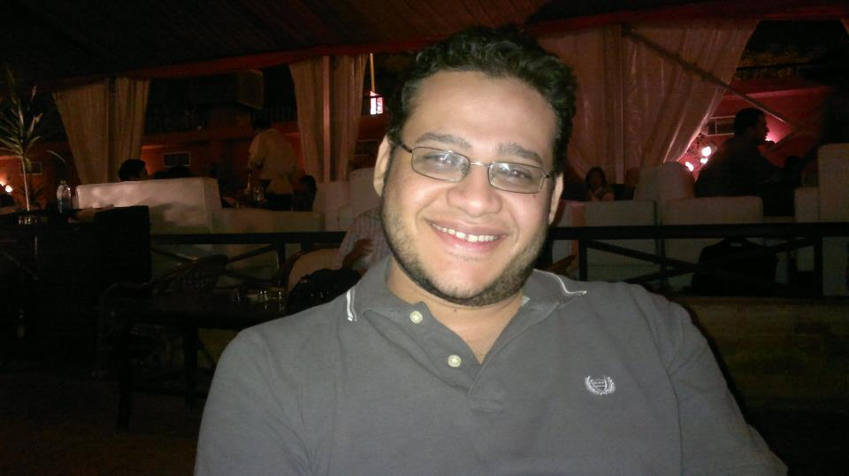

# ThreeFold Related Engineering Team

## coordination

### [Kristof](despiegk.md) : CTO/Architect

- specialities/skills
  - vlang
  - automation (vlang)
  - all rounder, want to learn & know a lot
  - content creater
  - tech architect
- my active engineering/content tasks
  - [tfgrid](https://github.com/orgs/threefoldtech/projects/172/views/13?filterQuery=-status%3A%22%E2%9C%85+Done%22) : to complete
  - [freeflow](https://github.com/orgs/freeflowuniverse/projects/3/views/8?filterQuery=-status%3A%22%E2%9C%85+Done%22+assignee%3Adespiegk)
  - [foundation](https://github.com/orgs/threefoldfoundation/projects/80/views/7?filterQuery=-status%3A%22%E2%9C%85+Done%22+assignee%3Adespiegk)
- active products
  - web publishing tools
  - [crystallib](https://github.com/freeflowuniverse/crystallib) (generic library for vlang)
  - [protocol.me](https://github.com/freeflowuniverse/protocolme)
  - some Vlang automation scripts, to see how to make it easier for our users on the TFGrid
- location: Zanzibar
- reports_to: Karoline

### [Ahmed Thabet](ahmed_thabet.md) : Development Lead

- specialities/skills
  - python
  - go
  - documentation
  - tech architect
- my active engineering/content tasks
  - [tfgrid](https://github.com/orgs/threefoldtech/projects/172)
- location: Cairo
- reports_to: Kristof

## TFGrid

### [Mahmoud Emad](mahmoud_emad.md) : Software Engineer

- specialities/skills
  - Golang
  - Vlang
  - Javascript
  - Python
- my active engineering/content tasks
  - [weblets](https://github.com/orgs/threefoldtech/projects/172/views/6)
  - [crystallib](https://github.com/orgs/freeflowuniverse/projects/3)
- location: Egypt
- reports_to: Ahmed Thabet

### [Omar Abdulaziz](omar.md) : Software Engineer

- specialities/skills
    - Golang
    - Typescript
    - Vue/Svelte
- my active engineering/content tasks
    - [tfgrid_dashboard](https://github.com/orgs/threefoldtech/projects/172/views/7)
    - [tfgridclient_proxy](https://github.com/orgs/threefoldtech/projects/172/views/12)
- active products
    - [grid_weblets](https://github.com/threefoldtech/grid_weblets)
    - [tfgrid_dashboard](https://github.com/threefoldtech/tfgrid_dashboard)
    - [tfgridclient_proxy](https://github.com/threefoldtech/tfgridclient_proxy)
- location: Egypt
- reports_to: Thabet
### [Amira Abouhadid](amira_abouhadid.md) : Software Engineer

- specialities/skills

  - Typescript/ Javascript
  - Golang
  - Python
  - Ruby
  - Java
  - Rust

- my active engineering/content tasks
  - [Polygon Bridge](https://github.com/threefoldfoundation/tft/projects/12)
  - [TFGrid Weblets](https://github.com/threefoldtech/grid_weblets)
  - [TFGrid Dashboard](https://github.com/threefoldtech/tfgrid_dashboard)
- location: Egypt
- reports_to: [Ahmed Thabet](ahmed_thabet.md), Reem Khamis and [Ahmed Hanafy](ahmed_hanafy.md)

### ZOS

### [Muhamad Azmy](azmy.md) : Software Engineer/Designer

- specialities/skills
  - Golang
  - Rust
  - Software Design
  - Operating Systems
- my active engineering/content tasks
  - [zos](https://github.com/orgs/threefoldtech/projects/172/views/5)
- active products
  - [zos](https://github.com/threefoldtech/zos)
  - [rmb-rs](https://github.com/threefoldtech/rmb-rs)
  - [zinit](https://github.com/threefoldtech/zinit)
  - [cloud-container](https://github.com/threefoldtech/cloud-container)
- location: Belgium
- reports_to: Rob

### [Dylan Verstraete](dylan.md) : Software Engineer/Designer

- specialities/skills
  - Golang
  - Rust
  - Javascript
  - Blockchain
- my active engineering/content tasks
  - [tfchain](https://github.com/orgs/threefoldtech/projects/172/views/9)
- active products
  - [tfchain](https://github.com/threefoldtech/tfchain)
  - [tfchain_graphql](https://github.com/threefoldtech/tfchain_graphql)
  - [tfchain_tft_bridge](https://github.com/threefoldtech/tfchain_tft_bridge)
  - [bsc_bridge](https://github.com/threefoldfoundation/tft)
- location: Belgium
- reports_to: Rob

### [Brandon Pille](brandon.md) : Software Engineer/Designer

- specialities/skills
  - Rust
  - Python
  - C/C++
  - Software Design
  - Testing
- my active engineering/content tasks
  - [tfchain](https://github.com/orgs/threefoldtech/projects/172/views/9)
- active products
  - [tfchain](https://github.com/threefoldtech/tfchain)
  - [tfchain_graphql](https://github.com/threefoldtech/tfchain_graphql)
- location: Belgium
- reports_to: Dylan

### [Erwan Renaut](erwan.md) : Software Engineer

- specialities/skills
    - Rust
    - C/C++
    - Java
    - Applied Mathematics
    - Computer Graphics
- my active engineering/content tasks
    - [tfchain](https://github.com/orgs/threefoldtech/projects/172/views/9)
- active products
    - [tfchain](https://github.com/threefoldtech/tfchain)
    - [tfchain_tft_bridge](https://github.com/threefoldtech/tfchain_tft_bridge)
- location: Brazil
- reports_to: Dylan

### [Mario Bassem](mariobassem.md) : Software Engineer

- specialities/skills
    - Rust
    - Golang
 
 - my active engineering/content tasks
    - [terraform provider](https://github.com/threefoldtech/terraform-provider-grid)
    - [rmb-go](https://github.com/threefoldtech/rmb_go)
- active products
    - [terraform provider](https://github.com/threefoldtech/terraform-provider-grid)
    - [gridproxy](https://github.com/threefoldtech/tfgridclient_proxy)
    - zos
    - [rmb-go](https://github.com/threefoldtech/rmb_go)
- location: Egypt
- reports_to: Ahmed Thabet

## TFGrid Support, Testing & Integration & QA

> TODO:

## TF Foundation (content, scripts, ...)

### [Rob Van Mieghem](vmieghemr.md) : Software Engineer

- specialities
  - Golang
  - Blockchain
  - Tech architect
- my active engineering/content tasks
  - [TFT on Polygon](https://github.com/threefoldfoundation/tft)
- active products
  - [TFT on Stellar](https://github.com/threefoldfoundation/tft-stellar)
  - [TFT on Polygon](https://github.com/threefoldfoundation/tft)
- location: Belgium
- reports_to: Kristof

> TODO:

## protocol.me / FreeFlow Tools

> TODO:

## FreeFlow Twin

> TODO: mainly jimber guys

## metaverse

> TODO

## misc

### [Timur](timurgordon.md) : developer

- specialities/skills
  - communicating tech
  - learning and teaching
  - interested in architectture
  - vlang
  - web development
- my active engineering/content tasks
  - [freeflow](https://github.com/orgs/freeflowuniverse/projects/3/views/8?filterQuery=-status%3A%22%E2%9C%85+Done%22+assignee%3Atimurgordon)
- active products
  - web templates and static sites
  - web publishing tools
  - ui framework using htmx and vweb
  - dao user interface
  - threefold publishing user interface
  - [crystallib](https://github.com/freeflowuniverse/crystallib) (generic library for vlang)
- location: Zanzibar / Istanbul
- reports_to: Kristof

### [Ehab](ehab_hassan.md) : UI developer/Graphic Designer

- specialties/skills
  - HTML/CSS/JavaScript/Some Vue JS
  - Website Framework Gridsome,Zola,Mobirise...
  - design with photoshop/illustrator
  - Video creator & Editing

- my active engineering/content tasks
  - [Threefold](https://github.com/orgs/threefoldfoundation/projects/80/views/4?filterQuery=ehab)
  - [Codescalers](https://github.com/codescalers/www_codescalers_egypt/issues/4)
- active products
  - web static sites
  - ThreeFold website
  - Freeflow website
- location: Egypt
- reports_to: Marketing Team / Nayer
