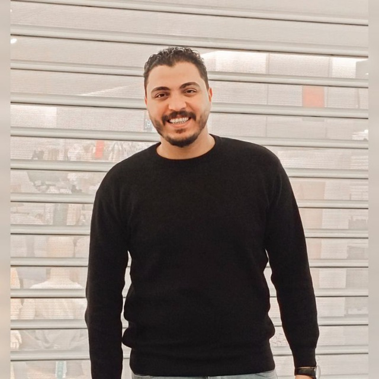

# ThreeFold Related Engineering Team

## coordination

### [Kristof](despiegk.md) : CTO/Architect

- specialities/skills
  - vlang
  - automation (vlang)
  - all rounder, want to learn & know a lot
  - content creater
  - tech architect
- my active engineering/content tasks
  - [tfgrid](https://github.com/orgs/threefoldtech/projects/172/views/13?filterQuery=-status%3A%22%E2%9C%85+Done%22) : to complete
  - [freeflow](https://github.com/orgs/freeflowuniverse/projects/3/views/8?filterQuery=-status%3A%22%E2%9C%85+Done%22+assignee%3Adespiegk)
  - [foundation](https://github.com/orgs/threefoldfoundation/projects/80/views/7?filterQuery=-status%3A%22%E2%9C%85+Done%22+assignee%3Adespiegk)
- active products
  - web publishing tools
  - [crystallib](https://github.com/freeflowuniverse/crystallib) (generic library for vlang)
  - [protocol.me](https://github.com/freeflowuniverse/protocolme)
  - some Vlang automation scripts, to see how to make it easier for our users on the TFGrid
- location: Zanzibar
- reports_to: Karoline

### [Ahmed Thabet](ahmed_thabet.md) : Development Lead

- specialities/skills
  - python
  - go
  - documentation
  - tech architect
- my active engineering/content tasks
  - [tfgrid](https://github.com/orgs/threefoldtech/projects/172)
- location: Cairo
- reports_to: Kristof

## TFGrid

### [Sameh Farouk](sameh_farouk.md) : Software Engineer

- specialities/skills
  - Python
  - Vlang
  - Golang
  - rust
  - Javascript
- my active engineering/content tasks
  - [tf-pinning-service](https://github.com/orgs/threefoldtech/projects/172/views/10)
- active products
  - [tf-pinning-service](https://github.com/threefoldtech/tf-pinning-service/)
  - [taiga_play](https://github.com/freeflowuniverse/taiga_play)
  - [Vlang-GridProxy-API-client](https://github.com/threefoldtech/vgrid/tree/development/gridproxy)
  - [rmb-rs](https://github.com/threefoldtech/rmb-rs)
  - [rmb-v](https://github.com/threefoldtech/rmb/commits/development_a5)
  - [owncloud_deployer](https://github.com/threefoldtech/owncloud_deployer)
  - [taiga-contrib-threefold-auth](https://github.com/threefoldtech/taiga-contrib-threefold-auth)
  - [TFGrid Weblets](https://github.com/threefoldtech/grid_weblets)
  - [freeflow_caprover](https://github.com/threefoldtech/freeflow_caprover)
  - [crystallib](https://github.com/freeflowuniverse/crystallib)
- location: Egypt
- reports_to: [Ahmed Hanafy](ahmed_hanafy.md)

### [Mahmoud Emad](mahmoud_emad.md) : Software Engineer

- specialities/skills
  - Golang
  - Vlang
  - Javascript
  - Python
- my active engineering/content tasks
  - [weblets](https://github.com/orgs/threefoldtech/projects/172/views/6)
  - [crystallib](https://github.com/orgs/freeflowuniverse/projects/3)
- location: Egypt
- reports_to: [Ahmed Hanafy](ahmed_hanafy.md)

### [Omar Abdulaziz](omar.md) : Software Engineer

- specialities/skills
  - Golang
  - Typescript
  - Vue/Svelte
- my active engineering/content tasks
  - [tfgrid_dashboard](https://github.com/orgs/threefoldtech/projects/172/views/7)
  - [tfgridclient_proxy](https://github.com/orgs/threefoldtech/projects/172/views/12)
- active products
  - [grid_weblets](https://github.com/threefoldtech/grid_weblets)
  - [tfgrid_dashboard](https://github.com/threefoldtech/tfgrid_dashboard)
  - [tfgridclient_proxy](https://github.com/threefoldtech/tfgridclient_proxy)
- location: Egypt
- reports_to: [Ahmed Hanafy](ahmed_hanafy.md)

### [Amira Abouhadid](amira_abouhadid.md) : Software Engineer

- specialities/skills

  - Typescript/ Javascript
  - Golang
  - Python
  - Ruby
  - Java
  - Rust

- my active engineering/content tasks
  - [Polygon Bridge](https://github.com/threefoldfoundation/tft/projects/12)
  - [TFGrid Weblets](https://github.com/threefoldtech/grid_weblets)
  - [TFGrid Dashboard](https://github.com/threefoldtech/tfgrid_dashboard)
- location: Egypt
- reports_to: [Ahmed Hanafy](ahmed_hanafy.md)

### [Rawda Gastan](rawda_gastan.md) : Software Engineer

- specialities/skills

  - Typescript/ Javascript
  - Golang
  - Python
  - Vue/ Svelte

- my active engineering/content tasks
  - PKID

- active products
  - [TFGrid Client](https://github.com/threefoldtech/grid3_client_ts)
  - [TFGrid Weblets](https://github.com/threefoldtech/grid_weblets)
  - [TFGrid Dashboard](https://github.com/threefoldtech/tfgrid_dashboard)

- location: Egypt
- reports_to: [Ahmed Thabet](ahmed_thabet.md)

### [Mayar Osama](mayar_osama.md) : Software Engineer

- specialities/skills
  - Golang
  - Javascript / Typescript
  - Python
- my active engineering/content tasks
  - [grid_weblets](https://github.com/orgs/threefoldtech/projects/172/views/6)
- active products
  - [tfgrid_dashboard](https://github.com/threefoldtech/tfgrid_dashboard)
  - [grid_weblets](https://github.com/threefoldtech/grid_weblets)
  - [tf_stats](https://github.com/threefoldtech/tfgrid_stats)
- location: Egypt
- reports_to: [Ahmed Hanafy](ahmed_hanafy.md)

### [Zainab Elgohary](zainab_elgohary.md) : Software Engineer

- specialities/skills
  - Javascript/Typescript
  - Vue/Svelte
- my active engineering/content tasks
  - [tfgrid_dashboard](https://github.com/orgs/threefoldtech/projects/172/views/7)
  - [grid_weblets](https://github.com/orgs/threefoldtech/projects/172/views/6)
- active products
  - [tfgrid_dashboard](https://github.com/threefoldtech/tfgrid_dashboard)
  - [grid_weblets](https://github.com/threefoldtech/grid_weblets)
  - [tf_stats](https://github.com/threefoldtech/tfgrid_stats)
- location: Egypt
- reports_to: [Ahmed Hanafy](ahmed_hanafy.md)

### [Ahmed Hanafy](ahmed_hanafy.md) : Software Engineer

- specialities/skills
  - Python
  - Typescript
  - Golang

- my active engineering/content tasks
  - [Grid Client](https://github.com/orgs/threefoldtech/projects/172/views/11)
  - [Grid Weblets](https://github.com/orgs/threefoldtech/projects/172/views/6)
  - [Grid Dashboard](https://github.com/orgs/threefoldtech/projects/172/views/7)
  - [Grid Proxy](https://github.com/orgs/threefoldtech/projects/172/views/12)

- active products
  - [Grid Client](https://github.com/threefoldtech/grid3_client_ts)
  - [Grid Weblets](https://github.com/threefoldtech/grid_weblets)
  - [Grid Dashboard](https://github.com/threefoldtech/tfgrid_dashboard)
  - [Grid Proxy](https://github.com/threefoldtech/tfgridclient_proxy)
- location: Egypt
- reports_to: [Ahmed Thabet](ahmed_thabet.md)

### [Mohamed Rabie](mohamed_rabie.md) : Software Engineer

- specialities/skills
  - Typescript
  - Vue/Svelte/React/Angular
  - Python
  - Dart/Flutter
- my active engineering/content tasks
  - [tfgrid_dashboard](https://github.com/orgs/threefoldtech/projects/172/views/7)
  - [grid_weblets](https://github.com/orgs/threefoldtech/projects/172/views/6)
  - [Grid Client](https://github.com/orgs/threefoldtech/projects/172/views/11)
- active products
  - [tfgrid_dashboard](https://github.com/threefoldtech/tfgrid_dashboard)
  - [grid_weblets](https://github.com/threefoldtech/grid_weblets)
  - [Grid Client](https://github.com/orgs/threefoldtech/projects/172/views/11)
  - [Profile Manger Extension](https://github.com/threefoldtech/profile-manager-extension)
- location: Egypt
- reports_to: [Ahmed Hanafy](ahmed_hanafy.md)

### ZOS

### [Muhamad Azmy](azmy.md) : Software Engineer/Designer

- specialities/skills
  - Golang
  - Rust
  - Software Design
  - Operating Systems
- my active engineering/content tasks
  - [zos](https://github.com/orgs/threefoldtech/projects/172/views/5)
- active products
  - [zos](https://github.com/threefoldtech/zos)
  - [rmb-rs](https://github.com/threefoldtech/rmb-rs)
  - [zinit](https://github.com/threefoldtech/zinit)
  - [cloud-container](https://github.com/threefoldtech/cloud-container)
- location: Belgium
- reports_to: Rob

### [Dylan Verstraete](dylan.md) : Software Engineer/Designer

- specialities/skills
  - Golang
  - Rust
  - Javascript
  - Blockchain
- my active engineering/content tasks
  - [tfchain](https://github.com/orgs/threefoldtech/projects/172/views/9)
- active products
  - [tfchain](https://github.com/threefoldtech/tfchain)
  - [tfchain_graphql](https://github.com/threefoldtech/tfchain_graphql)
  - [tfchain_tft_bridge](https://github.com/threefoldtech/tfchain_tft_bridge)
  - [bsc_bridge](https://github.com/threefoldfoundation/tft)
- location: Belgium
- reports_to: Rob

### [Brandon Pille](brandon.md) : Software Engineer/Designer

- specialities/skills
  - Rust
  - Python
  - C/C++
  - Software Design
  - Testing
- my active engineering/content tasks
  - [tfchain](https://github.com/orgs/threefoldtech/projects/172/views/9)
- active products
  - [tfchain](https://github.com/threefoldtech/tfchain)
  - [tfchain_graphql](https://github.com/threefoldtech/tfchain_graphql)
- location: Belgium
- reports_to: Dylan

### [Erwan Renaut](erwan.md) : Software Engineer

- specialities/skills
  - Rust
  - C/C++
  - Java
  - Applied Mathematics
  - Computer Graphics
- my active engineering/content tasks
  - [tfchain](https://github.com/orgs/threefoldtech/projects/172/views/9)
- active products
  - [tfchain](https://github.com/threefoldtech/tfchain)
  - [tfchain_graphql](https://github.com/threefoldtech/tfchain_graphql)
- location: Belgium
- reports_to: Dylan

### [Mario Bassem](mariobassem.md) : Software Engineer

- specialities/skills
  - Rust
  - Golang

- my active engineering/content tasks
  - [terraform provider](https://github.com/threefoldtech/terraform-provider-grid)
  - [rmb-go](https://github.com/threefoldtech/rmb_go)
- active products
  - [terraform provider](https://github.com/threefoldtech/terraform-provider-grid)
  - [gridproxy](https://github.com/threefoldtech/tfgridclient_proxy)
  - zos
  - [rmb-go](https://github.com/threefoldtech/rmb_go)
- location: Egypt
- reports_to: [Ahmed Thabet](ahmed_thabet.md)

### [Omar Kassem](omarKassem.md) : Software Engineer

- specialities/skills
  - JavaScript
  - TypeScript
  - C++
  - Python

- my active engineering/content tasks
  - [grid_weblets](https://github.com/orgs/threefoldtech/projects/172/views/6)
- active products
  - [grid_weblets](https://github.com/threefoldtech/grid_weblets)
- location: Egypt
- reports_to: [Ahmed Hanafy](ahmed_hanafy.md)

## TFGrid Support, Testing & Integration & QA

### [Ramez Saeed](ramez_saeed.md) : QA Team Lead

- specialities/skills
  - Software Testing.
  - Test Automation.
  - Python.
- my active engineering/content tasks
  - tfgrid testing.
  - Bug Assessments.
- location: Egypt
- reports_to: Reem Khamis

### [Mohamed Amer](mohamed_amer.md) : Software Test Engineer

- specialities/skills
  - Software Testing.
  - Test Automation.
  - Javascript.
  - Python.
- my active engineering/content tasks
  - tfgrid testing, verification & automation.
  - documentation.
- location: Egypt
- reports_to: Ramez Saeed

### [Ahmed Harby](ahmed_harby.md) : Software Test Engineer

- specialities/skills
  - Python
  - Selenium, Cypress JS/TS.
  - Test Automation.
  - Software Testing.
- my active engineering/content tasks
  - [TFDashboard](https://github.com/threefoldtech/tfgrid_dashboard/tree/development/tests/frontend_selenium) test automation.   
  - tfgrid testing, verification & automation.
- location: Egypt
- reports_to: Ramez Saeed

## TF Foundation (content, scripts, ...)

### [Rob Van Mieghem](vmieghemr.md) : Software Engineer

- specialities
  - Golang
  - Blockchain
  - Tech architect
- my active engineering/content tasks
  - [TFT on Polygon](https://github.com/threefoldfoundation/tft)
- active products
  - [TFT on Stellar](https://github.com/threefoldfoundation/tft-stellar)
  - [TFT on Polygon](https://github.com/threefoldfoundation/tft)
- location: Belgium
- reports_to: Kristof

> TODO:

## protocol.me / FreeFlow Tools

> TODO:

## FreeFlow Twin

> TODO: mainly jimber guys

## metaverse

> TODO

## misc

### [Timur](timurgordon.md) : developer

- specialities/skills
  - communicating tech
  - learning and teaching
  - interested in architectture
  - vlang
  - web development
- my active engineering/content tasks
  - [freeflow](https://github.com/orgs/freeflowuniverse/projects/3/views/8?filterQuery=-status%3A%22%E2%9C%85+Done%22+assignee%3Atimurgordon)
- active products
  - web templates and static sites
  - web publishing tools
  - ui framework using htmx and vweb
  - dao user interface
  - threefold publishing user interface
  - [crystallib](https://github.com/freeflowuniverse/crystallib) (generic library for vlang)
- location: Zanzibar / Istanbul
- reports_to: Kristof

### [Ehab](ehab_hassan.md) : UI developer/Graphic Designer

- specialties/skills
  - HTML/CSS/JavaScript/Some Vue JS
  - Website Framework Gridsome,Zola,Mobirise...
  - design with photoshop/illustrator
  - Video creator & Editing

- my active engineering/content tasks
  - [Threefold](https://github.com/orgs/threefoldfoundation/projects/80/views/4?filterQuery=ehab)
  - [Codescalers](https://github.com/codescalers/www_codescalers_egypt/issues/4)
- active products
  - web static sites
  - ThreeFold website
  - Freeflow website
- location: Egypt
- reports_to: Marketing Team / Nayer

### [Sasha](sasha_astiadi.md) : Product Scrum / Web & Wiki Content Manager

- specialties/skills
  - Scrum
  - Content Writer
  - Github, Publishtools
  - HTML/CSS
  - Website Framework: Gridsome,Zola,Mobirise
  - design with photoshop/illustrator
  - Video creator & Editing

- My active engineering/content tasks
  - Weekly Product Scrum
  - Web Presence Project Mgmt
  - ThreeFold Wikis Mgmt
  - Github Cleanups
  - Forum Content on Product Updates
- location: Spain
- reports_to: KDS / Marketing Team / Timur

### [Jonas](jonas_delrue.md) : Product Manager Jimber (TF-Connect / Digitaltwin / Kutana / Wallet)

- Specialities/skills
 - Product Management
 - C++ / Go / PHP / Docker/ Nginx / Flutter ..
 - Yggdrasil
- Tasks
 - Managing Jimber team working on above projects
- Location: Belgium
- Reports to: KDS 

### [Lennert](lennert_defauw.md) : Software Developer Jimber

- Specialities/skills
  - Docker
  - TypeScript / Javascript / Vue3 / NodeJS
  - Dart / Flutter
  - Python
- My active engineering/content tasks
   - [ThreeFold Mobile App](https://github.com/threefoldtech/threefold_connect)
   - [ThreeFold Wallet](https://github.com/threefoldtech/wallet-next)
   - [FreeFlow](https://github.com/threefoldtech/twin_aydo)
- Location: Belgium
- Reports to: Jonas Delrue 
